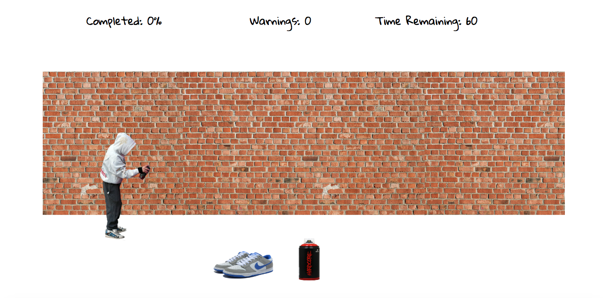
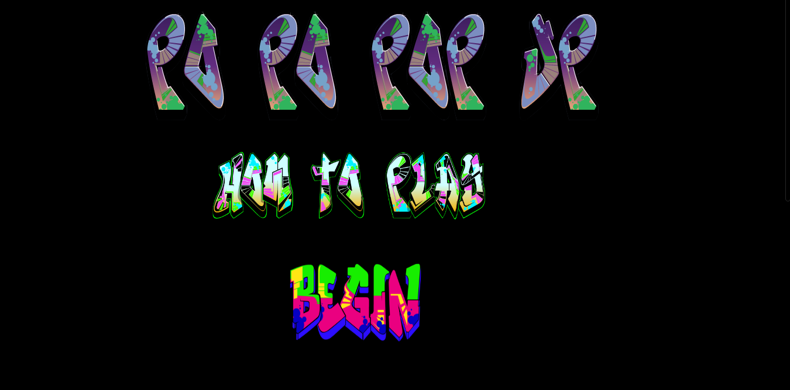
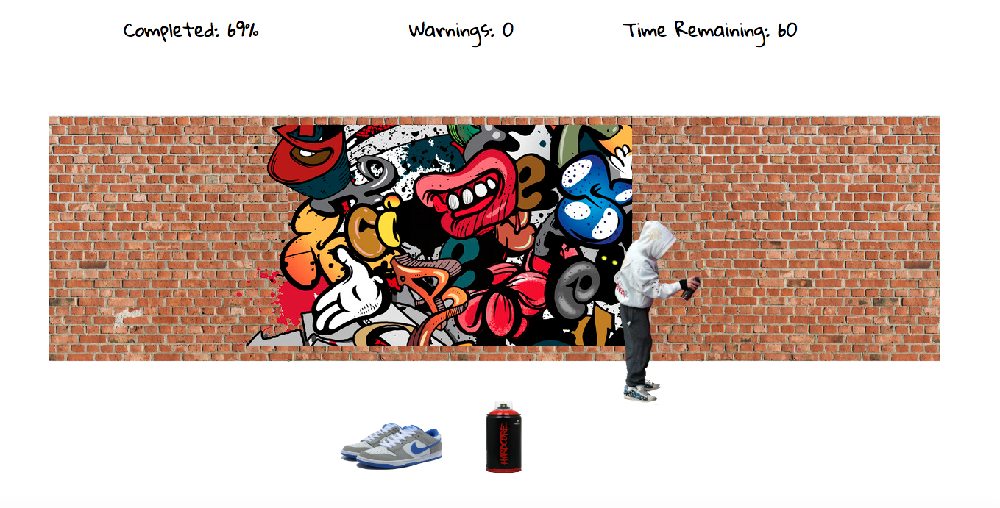

# projectOne

# Po Po Pop Up

###GA WDI London - Project 1

#### Introducing Po Po Pop Up

This is a game of patience and timing. You need both to be successful! The aim of the game is to complete the painting before the timer runs out whilst also trying to avoid being caught by the policeman as he appears from behind the wall at random intervals.

#####[Play it here!](https://hangman-wdi-one.herokuapp.com/ "Here!")

#####Rules

1. Hold down the spray can to start spraying the wall
2. Release the can when you want to move to the next section
3. Make sure you are not holding down the spray can when the policeman appears otherwise he will give you a warning. 3 warnings and it's game over!
4. Try to complete the painting within 60 seconds to Win

####Approach / How it works

The game starts at the top of the page where the choices are to either 'Begin' or learn 'How To Play'. If you select 'How To Play', then a box is made visible which has the rules inside and this will become hidden again after 15 seconds or when the player clicks 'Begin'. After clicking 'Begin' the page scrolls down automatically to the bottom where the game is waiting for you to get started. As you hold down the spray can an image which has been split into 16 divs slowly starts to appear. This is done by selecting each individual div depending on where the player is positioned and the opacity of the corresponding div slowly starts to fade from 0 to 1. At random intervals a policeman will pop up behind the wall and try to catch you graffitiing. This is done by toggling between two variables being true and false and if they are both true whilst you are spraying you will receive a warning. Once you have 1 warning the text changes to be red and after 2 warnings it starts to flash. On the third warning the game is over and you are invited to restart the game and try again. If you manage to make it through the 60 seconds without being caught, the player is made aware of what percentage of the image they managed to complete and offered a restart to try and beat their previous score.

There are sounds that are triggered upon:

1. The page loading
2. Pressing the begin button
3. Holding down the spray can
4. During gameplay

####The build

* HTML 5, CSS and jQuery were used to create this game.
* Animation was created using the Animate.css stylesheet.
* The Google Web Font 'Gloria Hallelujah' and 'Caveat Brush' have been used to style the game.

#### Problems & Challenges

The main problem I had with this game was knowing which divs opacity should change based on where the player is stood in relation to the wall. The way I managed to do this was by adding 1 to a variable every time the player moved right and subtracting 1 from the same variable every time they moved left. I was then able to use this variable as the index number for which div's opacity should be changing which worked really well. Given more time I would like to have made the game more responsive as currently it only also works with an ipad screen horizontally.
